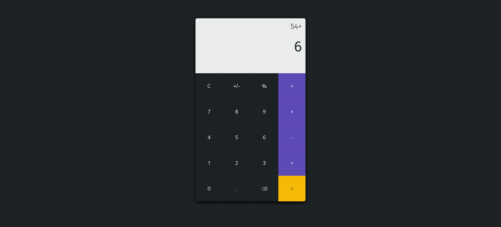

# Calculator

## About

A simple calculator that can perform basic operations(addition, subtraction, multiplication and division)

[Live Preview](https://magn3tism.github.io/calculator/)

[Design Credit](https://www.pinterest.com/pin/9499849194983095/)

## Made Using

- HTML
- CSS
- JavaScript

## Screenshots

